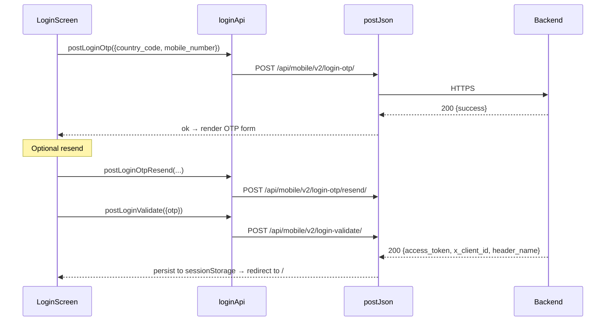
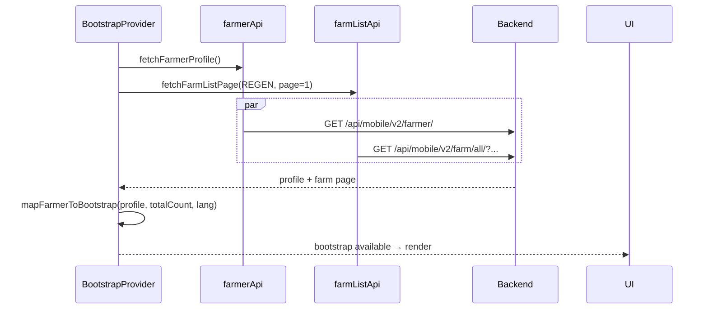
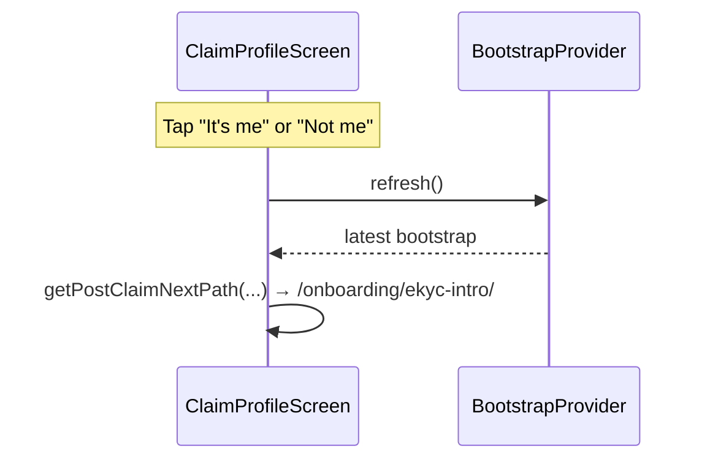
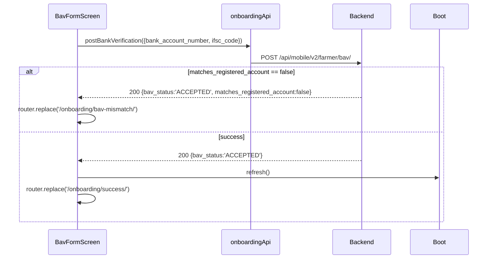
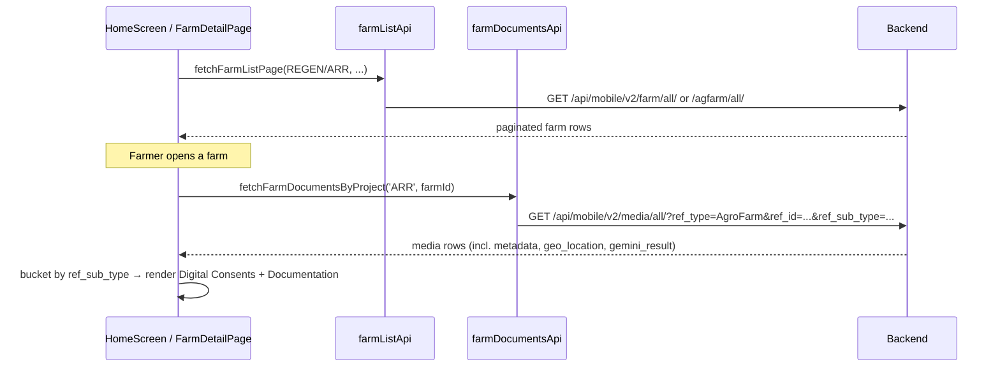
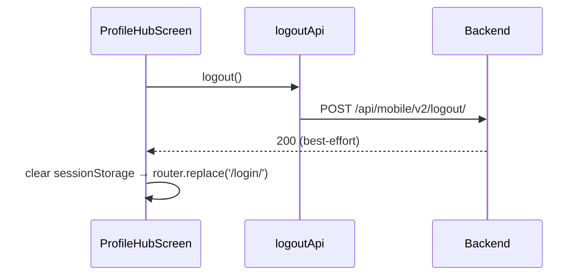
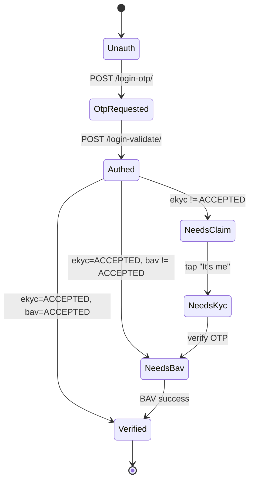

# Farmer Portal — Backend API Contract (Slim)

> **Audience.** Backend engineers wiring the Varaha Farmer Portal to live
> infrastructure (test → prod). Source of truth for every HTTP surface the
> portal consumes.
>
> **Scope.** The portal hits **exactly 9 endpoints**. Six are reused from the
> existing mobile API (login OTP, login OTP resend, login validate, logout,
> farmer profile, farm list, media list). **Three are new** and must be
> implemented for go-live: KYC Aadhaar consent + OTP trigger, KYC Aadhaar
> OTP verification, and Bank Account Verification.
>
> **Companion read.** For the system context — frontend layering, SDLC,
> environment promotion, Docker/EKS, security checklist —
> see [`docs/ARCHITECTURE_AND_SDLC.md`](./ARCHITECTURE_AND_SDLC.md).

---

## 0. Transport conventions

| Concern | Value |
| --- | --- |
| Base URL (prod) | `https://backend.varahaag.com` |
| Base URL (test) | `https://backendtest.varahaag.com` |
| Base URL (dev) | empty → Next.js rewrites `/api/*` and `/core/*` to `DEV_PROXY_TARGET` |
| Path trailing slash | **Required** (`APPEND_SLASH=True`). Enforced by `ensureApiTrailingSlash`. |
| Content type | `application/json` for every endpoint in the slim surface. No multipart anywhere. |
| Auth | `Authorization: Bearer <access_token>` + the dynamic client header (e.g. `X-Client-ID: <uuid>`) returned by `/login-validate/`. |
| Status enum | `MISSING \| PENDING \| IN_PROGRESS \| ACCEPTED \| REJECTED` (uppercase). |
| Time format | Epoch **seconds** for `created_datetime`, `start_datetime`, `end_datetime`. ISO-8601 for human-readable date fields. |
| Pagination | `page_number` (1-indexed), `page_size` (≤ 100), envelope `{ page_size, page_number, total_pages, total_count, next, previous, data[] }`. |
| 401 behaviour | Frontend clears `sessionStorage` and hard-navigates to `/login/`. |
| 404 / 501 on onboarding writes | Frontend tolerates as "endpoint not deployed yet" and advances optimistically. Must return 2xx in production. |
| CORS | Same-origin in prod (Next.js proxy). For cross-origin, allow `Authorization`, `Content-Type`, the X-client header name, and `OPTIONS` preflights. |
| Logging | Never log request bodies or headers — they carry OTPs, tokens, Aadhaar refs, account numbers. |

### Error envelope (any of these wins, in order):

```json
{ "detail":  "Mobile number not registered." }
{ "message": "Mobile number not registered." }
{ "error":   "Mobile number not registered." }
{ "errors":  [{ "detail": "Mobile number not registered." }] }
```

The frontend `ApiError` carries `status`, `body`, and the surfaced `message`.

---

## 1. The 9 endpoints

| # | Method | Path | Bucket | Status | Frontend caller |
| - | ------ | ---- | ------ | ------ | --------------- |
| 1 | POST | `/api/mobile/v2/login-otp/` | Auth | **Reused** | `services/loginApi.ts` |
| 2 | POST | `/api/mobile/v2/login-otp/resend/` | Auth | **Reused** | `services/loginApi.ts` |
| 3 | POST | `/api/mobile/v2/login-validate/` | Auth | **Reused** | `services/loginApi.ts` |
| 4 | POST | `/api/mobile/v2/logout/` | Auth | **Reused** | `services/logoutApi.ts` |
| 5 | GET  | `/api/mobile/v2/farmer/` | Profile | **Reused** | `services/farmerApi.ts` |
| 6 | GET  | `/api/mobile/v2/farm/all/` | Farms (REGEN) | **Reused** | `services/farmListApi.ts` |
| 7 | GET  | `/api/mobile/v2/agfarm/all/` | Farms (ARR) | **Reused** | `services/farmListApi.ts` |
| 8 | GET  | `/api/mobile/v2/media/all/` | Media | **Reused** | `services/farmDocumentsApi.ts` |
| 9 | GET  | `/api/mobile/v2/kyari/all/?agfarm_id=<id>` | Kyaari | **Reused** | `services/kyaariApi.ts` |
| 10a| POST | `/api/mobile/v2/farmer/kyc/aadhaar/otp/` | KYC | **Live** | `postAadhaarConsentOtp` |
| 10b| POST | `/api/mobile/v2/farmer/kyc/aadhaar/verify/` | KYC | **Live** | `postAadhaarVerifyOtp` |
| 10c| POST | `/api/mobile/v2/farmer/kyc-status/update/` | KYC | **Live** | `postKycStatusUpdate` (after OTP verify) |
| 10d| POST | `/api/mobile/v2/farmer/verification-status/` | Profile | **Live** | `postFarmerVerificationStatus` (bootstrap refresh) |
| 10e| POST | `/bre/v1/farmer/bav/` | BAV | **Live** | `postBankVerification` |

That's it. No `/bootstrap/`, no `/identity-confirmation/`, no `/ekyc/status/`,
no `/bav/validate/` + `/bav/update/` split, no `/notifications/`, no
`/preferences/`. The portal derives notifications and preferences locally
from the profile + farm + media payloads.

---

## 2. NEW endpoints (the only three you need to build)

These are the contracts you implement; everything else already exists.

### 2.1 `POST /api/mobile/v2/farmer/kyc/aadhaar/otp/` — KYC Aadhaar consent + OTP trigger

**Purpose.** Capture the farmer's explicit Aadhaar eKYC consent and dispatch
an OTP to the Aadhaar-linked mobile.

**Request body**

```json
{
  "farmer_id": "farmer_001",
  "aadhaar_number": "289537985658",
  "consent": "y"
}
```

| Field | Type | Notes |
| --- | --- | --- |
| `farmer_id` | string | From `bootstrap.farmerApiId` (`farmer_id` on profile or stringified numeric `id`). |
| `aadhaar_number` | string (12 digits) | From `bootstrap.aadhaarNumber` (full Aadhaar on farmer profile — **not** the masked display value). |
| `consent` | `"y" \| "n"` | Lowercase per backend contract; portal sends `"y"` when the farmer checks the consent box. |

**Success response (2xx)**

```json
{
  "success": true,
  "reference_id": "kyc_otp_8f3c2a1b9d",
  "masked_aadhaar": "XXXX XXXX 1234"
}
```

| Field | Type | Notes |
| --- | --- | --- |
| `reference_id` | string | **Required.** Opaque OTP transaction handle. The frontend echoes this back to the verify call so the backend can correlate OTP → request → farmer without holding session state. Snake-case canonical; camelCase `referenceId` accepted for forward-compat. |
| `masked_aadhaar` | string (optional) | Display-only echo. |

**Errors (4xx)**

| Status | Meaning | UI behaviour |
| --- | --- | --- |
| 400 | Invalid Aadhaar or consent missing | Toast with `detail` |
| 401 | Token expired | Hard-redirect to `/login/` |
| 409 | Active OTP already pending | Toast — user should retry in N seconds |
| 429 | Rate-limited | Toast |

**Frontend trigger.** `src/screens/onboarding/EkycOtpScreen.tsx` — fires on
the **first** time the consent checkbox transitions to checked. Subsequent
toggles do not re-trigger.

### 2.2 `POST /api/mobile/v2/farmer/kyc/aadhaar/verify/` — KYC OTP verification

**Purpose.** Verify the OTP the farmer just received and complete eKYC. The
`reference_id` returned by the trigger call (§2.1) is echoed back here so
the backend can match the OTP to the originating request.

**Request body**

```json
{
  "farmer_id": "farmer_001",
  "reference_id": "77040647",
  "otp": "592231"
}
```

| Field | Type | Notes |
| --- | --- | --- |
| `farmer_id` | string | Same as §2.1. |
| `reference_id` | string | **Required.** The value the trigger API returned. |
| `otp` | string (6 digits) | OTP entered by the farmer. |

After a successful verify, the portal calls `POST /api/mobile/v2/farmer/kyc-status/update/` with `{ farmer_id, kyc_status: "IN_PROGRESS" }`, then refreshes bootstrap via `verification-status`.

**Success response (2xx)**

```json
{
  "success": true,
  "ekyc_status": "ACCEPTED"
}
```

`ekyc_status` should be `ACCEPTED` on success. The frontend refreshes the
bootstrap immediately after this call, so the next `/farmer/` response
should already reflect the new status (`farmer.ekyc_status === "ACCEPTED"`
or the extended `ext.ekyc_status` field — whichever the profile API exposes).

**Errors (4xx)**

| Status | Meaning |
| --- | --- |
| 400 | Wrong OTP, OTP expired, missing/invalid `reference_id`, or no active OTP request |
| 401 | Token expired |
| 429 | Too many failed attempts |

**Frontend trigger.** Same screen, on submit when OTP is 6 digits and consent
is checked. The `reference_id` stored from the trigger response is passed
through automatically.

### 2.3 `POST /bre/v1/farmer/bav/` — Bank Account Verification

**Purpose.** Verify the farmer's bank account (penny-drop or equivalent).

**Request body**

```json
{
  "farmer_id": "farmer_001",
  "ifsc": "SBIN0015348",
  "account_number": "37596492760"
}
```

| Field | Type | Notes |
| --- | --- | --- |
| `farmer_id` | string | `bootstrap.farmerApiId` |
| `ifsc` | string | Uppercased IFSC from the form |
| `account_number` | string | Digits only |

**Success response (2xx)**

```json
{
  "success": true,
  "bav_status": "ACCEPTED",
  "matches_registered_account": true
}
```

| Field | Type | Notes |
| --- | --- | --- |
| `bav_status` | `MISSING \| PENDING \| IN_PROGRESS \| ACCEPTED \| REJECTED` | Updates the bootstrap. |
| `matches_registered_account` | boolean (optional) | Set to `false` if the verified account differs from the one Varaha had on file. When `false`, the frontend routes the farmer to `/onboarding/bav-mismatch/`. Omit / `true` ⇒ normal success path. |

**Errors (4xx)**

| Status | Meaning |
| --- | --- |
| 400 | Invalid IFSC / account format |
| 422 | Penny-drop failed (e.g. account inactive) |
| 401 | Token expired |

**Frontend trigger.** `src/screens/onboarding/BavFormScreen.tsx` on submit
for both first-time and `?mode=update` paths. The "passbook image" file
input is collected client-side in update mode (for UX continuity) but is
**not transmitted** — backend should ignore any extra fields.

---

## 3. Reused endpoints (already deployed — no changes required)

Documented here only for completeness so the consumer index is clear.

### 3.1 `POST /api/mobile/v2/login-otp/`

Body: `{ "country_code": "+91", "mobile_number": "9876543210" }`.
Response: `{ "success": true, "expires_in": 60 }` (or backend-equivalent).
401 means the mobile isn't registered.

### 3.2 `POST /api/mobile/v2/login-otp/resend/`

Same body as 3.1. Server-enforced cool-down.

### 3.3 `POST /api/mobile/v2/login-validate/`

Body: `{ "country_code", "mobile_number", "otp" }`.
Response: `{ "access_token": "...", "x_client_id": "...", "x_client_header_name": "X-Client-ID" }`.
The frontend stores the token + dynamic header for subsequent calls.

### 3.4 `POST /api/mobile/v2/logout/`

No body. Server revokes the token. Frontend clears `sessionStorage` regardless of response status.

### 3.5 `GET /api/mobile/v2/farmer/`

Returns the farmer profile (name, masked Aadhaar, masked bank account,
region, KYC status, BAV status, language preference, etc.).
This is the only farmer-scoped read the portal makes — `composeBootstrap`
calls it once at app start and after every onboarding write.

### 3.6 `GET /api/mobile/v2/farm/all/?project_type=REGEN&page_number=1&page_size=50`

Paginated REGEN farm list. Envelope as in §0.

### 3.7 `GET /api/mobile/v2/agfarm/all/?project_type=ARR&page_number=1&page_size=50`

Paginated ARR farm list. Same envelope.

### 3.8 `GET /api/mobile/v2/kyari/all/?agfarm_id=<id>`

Returns the kyaari list for a single farm. Used in two places:

1. **Farm Detail screen** — renders the "Kyaaris mapped" list with per-kyaari status.
2. **Home FarmCard** — feeds the calculated eligibility chip (see §5.1 below).

Note the **singular** spelling `kyari` in the URL — this matches the
backend's existing naming convention (the same spelling shows up in
farm-row fields like `kyari_count`). The portal sends **both**
`?agfarm_id=<id>` and `?farm_id=<id>` in the query string so the call
works regardless of which key the backend filters on (unknown params
are expected to be ignored).

The endpoint requires the standard auth headers (`Authorization:
Bearer …` and the dynamic `X-Client-ID` returned from login). Probing
without those headers returns **406** with body
`{"code":"1100","info":"Invalid Header","message":"Invalid Header, missing keys:['X-Client-ID']"}`
— that 406 confirms the endpoint exists, it just needs auth.

**Response shape** — array of objects. The portal accepts any of these
envelopes (first match wins):

```
[ … ]                       ← bare array
{ "data":    [ … ] }
{ "results": [ … ] }
{ "kyaris":  [ … ] }
{ "kyaaris": [ … ] }
{ "data": { "data": [ … ] } }
```

Per-row, the parser accepts the following field aliases (first wins):

| Logical field | Accepted keys |
| --- | --- |
| Identifier | `id` / `kyari_id` / `kyaari_id` |
| Display name | `kyari_name` / `kyaari_name` / `name` (falls back to "Kyaari N") |
| Area (acres) | `area_in_acres` / `area_acres` / `area` |
| Tree count | `tree_count` / `trees` / `number_of_trees` |
| Verification status | `verification_status` / `status` (one of `MISSING \| PENDING \| IN_PROGRESS \| ACCEPTED \| REJECTED`) |
| Plantation year *(opt)* | `plantation_year` |
| Plantation type *(opt)* | `plantation_type` |
| Surveyor *(opt)* | `surveyor_name` |
| Created (epoch s) *(opt)* | `created_datetime` |
| Location *(opt)* | `block_name` / `location` |

Example minimum payload:

```json
[
  {
    "id": 643,
    "kyari_name": "Kyaari 1",
    "area_in_acres": 1.4,
    "tree_count": 120,
    "verification_status": "ACCEPTED"
  }
]
```

If the endpoint returns 404 / 501 the portal degrades gracefully to an
empty list ("No kyaaris mapped yet.") — but the calculated eligibility
chip will not be accurate until the endpoint is reachable.

### 3.9 `GET /api/mobile/v2/media/all/?ref_type=AgroFarm&ref_id=<farmId>&ref_sub_type=<csv>`

**Powers everything document-related.** Returns the array of media records
for the requested farm + buckets. The portal pulls every document attribute
from this endpoint — there is no separate document-detail call. Each row
is mapped into `FarmMediaDoc` (see `src/types/farmDocuments.api.ts`):

```ts
{
  id: number
  ref_type: string
  ref_sub_type: string
  media_url: string | null          // S3 presigned URL or absolute
  content_type: string | null       // "application/pdf" | "image/jpeg" | ...
  filename: string | null
  verification_status: "MISSING" | "PENDING" | "ACCEPTED" | "REJECTED"
  verification_remarks: string | null
  created_datetime: number          // epoch seconds
  metadata?: object | null          // free-form (EXIF, capture device, etc.)
  geo_location?: {                  // optional, when available
    latitude: number | null
    longitude: number | null
    accuracy: number | null
  } | null
  gemini_result?: object | null     // AI summary / classification payload
}
```

`metadata`, `geo_location`, and `gemini_result` are **optional** — the
portal renders them when present and degrades gracefully when absent.

The portal slices the response into two buckets:

- **Digital Consents** (`AgroFarmDigitalCRA`, `AgroFarmDigitalFPIC`) —
  shown only when `bootstrap.ekycStatus === 'ACCEPTED'`. AI voice summary
  surface uses `gemini_result`.
- **Documentation** — always visible, PDF / image preview only,
  rendered in **this priority order**:
  1. `AgroFarmLandRecord` — Land Document
  2. `AgroFarmLandLordDeclaration` — Land Declaration
  3. `AgroFarmHoldingConsent` — Farmer Holding Consent
  4. `AgroFarmFPIC` — FPIC
  5. `AgroFarmFPICLocal` — FPIC Local

  `AgroFarmImage` is a separate stream consumed by the photo carousel
  on the Farm Detail header — it is not rendered as a row in the
  Documentation list.

---

## 4. Sequence diagrams

Each diagram shows where every API in this contract gets triggered on the
frontend, what function calls it, and what the server is expected to do.
Lane names map 1:1 to real files:

- **UI** — a React screen in `src/screens/*`
- **Hook** — a React hook or provider (`BootstrapProvider`, `AuthProvider`)
- **Svc** — a service-layer module under `src/services/*Api.ts`
- **HTTP** — wrapper in `src/services/http/*`
- **BE** — Django backend

### 4.1 Login



### 4.2 Bootstrap (after login or refresh)



No separate `/bootstrap/` call. Total roundtrips after login: **2**.

### 4.3 Claim identity (Confirm it's you)



**No API call.** Identity confirmation is recorded implicitly by the next
KYC trigger.

### 4.4 KYC (the new flow)

```mermaid
sequenceDiagram
  participant UI as EkycOtpScreen
  participant Svc as onboardingApi
  participant BE as Backend

  Note over UI: Farmer ticks consent checkbox (1st time)
  UI->>Svc: postAadhaarConsentOtp({aadhaar_number, consent:'Y'})
  Svc->>BE: POST /api/mobile/v2/farmer/kyc/aadhaar/otp/
  BE-->>UI: 200 {success, reference_id} — OTP dispatched to mobile
  UI->>UI: store reference_id; Toast "OTP sent to Aadhaar linked mobile"

  Note over UI: Farmer enters 6-digit OTP, taps Verify
  UI->>Svc: postAadhaarVerifyOtp({reference_id, otp})
  Svc->>BE: POST /api/mobile/v2/farmer/kyc/aadhaar/verify/
  BE-->>UI: 200 {success, ekyc_status:'ACCEPTED'}
  UI->>Boot: refresh()
  Boot->>BE: GET /api/mobile/v2/farmer/
  BE-->>Boot: profile with ekyc_status=ACCEPTED
  UI->>UI: router.replace('/onboarding/bav-intro/')
```

### 4.5 BAV (the new endpoint)



### 4.6 Farms & documents



### 4.7 Logout



---

## 5. Farm card status calculation

The two chips on each Home `FarmCard` ("Eligibility" + "Consent") are **not**
the raw `verification_status` field from `/farm/all/` or `/agfarm/all/`.
They are calculated client-side from three live signals:

### 5.1 Eligibility

```
eligibility = combine(
  landDocStatus,      // latest AgroFarmLandRecord from /media/all/
  idStatus,           // bootstrap.ekycStatus (farmer-level eKYC)
  kyaariAggregate,    // "any one ACCEPTED" rule over /agfarm/{id}/kyaari/all/
)
```

`idStatus` reads from `bootstrap.ekycStatus` because the ID Card is a
farmer artefact, not a per-farm artefact — it would be the same value
for every card. The land doc and kyaari aggregate are per-farm.

Cascade applied to the three inputs (PRIORITY order, top wins):

| # | Condition | Result |
| - | --- | --- |
| 1 | All three `ACCEPTED` | `ACCEPTED` |
| 2 | Any `REJECTED` | `REJECTED` |
| 3 | Any `PENDING` (or `IN_PROGRESS`) | `PENDING` |
| 4 | Any `MISSING` | `MISSING` |

`kyaariAggregate` is itself derived using the same cascade with one
override:
- `ACCEPTED` if **any** kyaari is `ACCEPTED` (per spec: "any one
  kyaari has to be accepted under that farm")
- else any `REJECTED` → `REJECTED`
- else any `PENDING` → `PENDING`
- else `MISSING` (also when the kyaari list is empty)

Status-string normalisation is centralised in
`utils/farmCardStatusCompute.ts#normalizeVerificationStatus` and reused
by **both** the calculated chip on Home and the per-document pill on
Farm Detail — so the two surfaces are guaranteed to interpret the same
backend value identically.

### 5.2 Consent

```
consent = latest(/media/all/[AgroFarmDigitalCRA]).verification_status
```

Collapsed on the listing to a binary chip:
- `"Generated"` if the latest CRA doc exists with `media_url` and status `ACCEPTED`
- `"Yet to generate"` otherwise

### 5.3 Data dependencies (per card render)

Each `FarmCard` fires two GETs in parallel:

1. `GET /api/mobile/v2/media/all/?ref_type=AgroFarm&ref_id=<id>&ref_sub_type=...`
2. `GET /api/mobile/v2/agfarm/<id>/kyaari/all/`

Both are cached by React Query with `staleTime: 60_000` so navigating
Home → Farm Detail → Home is essentially free.

While the queries are in flight, the chip shows a neutral "—" rather
than the farm row's general `verification_status`. We deliberately do
NOT seed from the row-level field — it would create a brief
inconsistency with the per-document / per-kyaari values on the Farm
Detail screen. Showing "—" for a beat is the honest answer.

---

## 6. State machine — auth & onboarding gates



The portal **never blocks login on KYC/BAV** — the farmer lands on Home
after `Authed`, and a banner nudges them through the remaining gates. The
banner is sourced entirely from `bootstrap.ekycStatus` + `bootstrap.bavStatus`.

---

## 7. Removed endpoints (do NOT implement)

These were previously referenced in the codebase / earlier drafts and have
been deleted. If you find them in older docs, they are stale:

- `GET /api/mobile/v2/farmer/bootstrap/` — composed client-side from `/farmer/` + `/farm/all/`
- `POST /api/mobile/v2/farmer/identity-confirmation/` — implicit, no network call
- `POST /api/mobile/v2/farmer/ekyc/initiate/` — replaced by `kyc/aadhaar/otp/`
- `POST /api/mobile/v2/farmer/ekyc/verify-otp/` — replaced by `kyc/aadhaar/verify/`
- `GET  /api/mobile/v2/farmer/ekyc/status/` — derived from `/farmer/`
- `GET  /api/mobile/v2/farmer/bank-account/` — derived from `/farmer/`
- `POST /api/mobile/v2/farmer/bav/validate/` — replaced by `bav/`
- `POST /api/mobile/v2/farmer/bav/update/` — replaced by `bav/` (no multipart)
- `GET  /api/mobile/v2/farmer/notifications/` — derived from bootstrap + media
- `GET  /api/mobile/v2/farmer/preferences/` — derived from `/farmer/` (language)

---

## 8. Go-live checklist (backend)

- [ ] Implement `POST /api/mobile/v2/farmer/kyc/aadhaar/otp/`
- [ ] Implement `POST /api/mobile/v2/farmer/kyc/aadhaar/verify/`
- [ ] Implement `POST /api/mobile/v2/farmer/bav/`
- [ ] Ensure `/api/mobile/v2/farmer/` returns the up-to-date `ekyc_status` and `bav_status` immediately after the respective writes commit (no eventual consistency gap > 500ms).
- [ ] Confirm `/api/mobile/v2/media/all/` returns `metadata`, `geo_location`, and `gemini_result` (optional fields — leave them null if not available, do NOT 404).
- [ ] Confirm `APPEND_SLASH=True` for every new endpoint.
- [ ] Confirm `401` returns the standard error envelope so the frontend interceptor surfaces it cleanly.
- [ ] Add audit logging on the three new endpoints (without bodies).
- [ ] Rate-limit `kyc/aadhaar/otp/` (suggest ≤ 3 / hour / farmer).
- [ ] Rate-limit `bav/` (suggest ≤ 5 / hour / farmer).

That's all the wiring required. The portal is otherwise fully self-contained.
