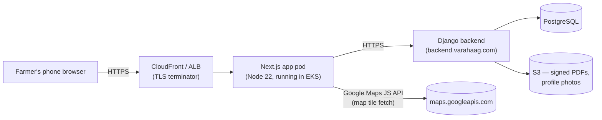
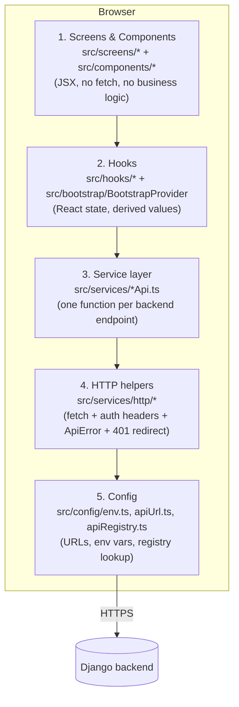
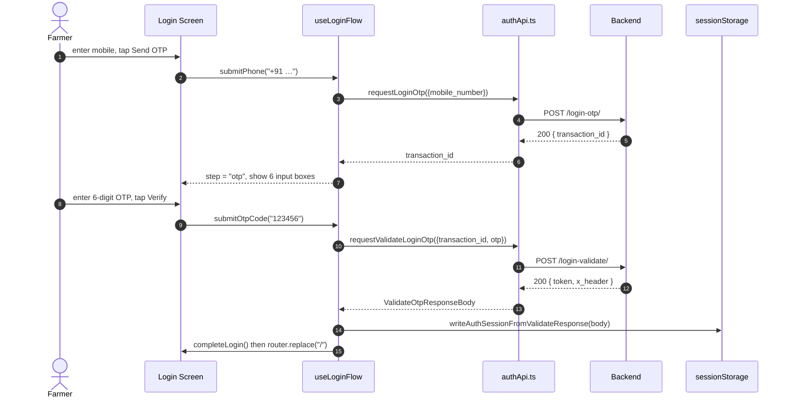
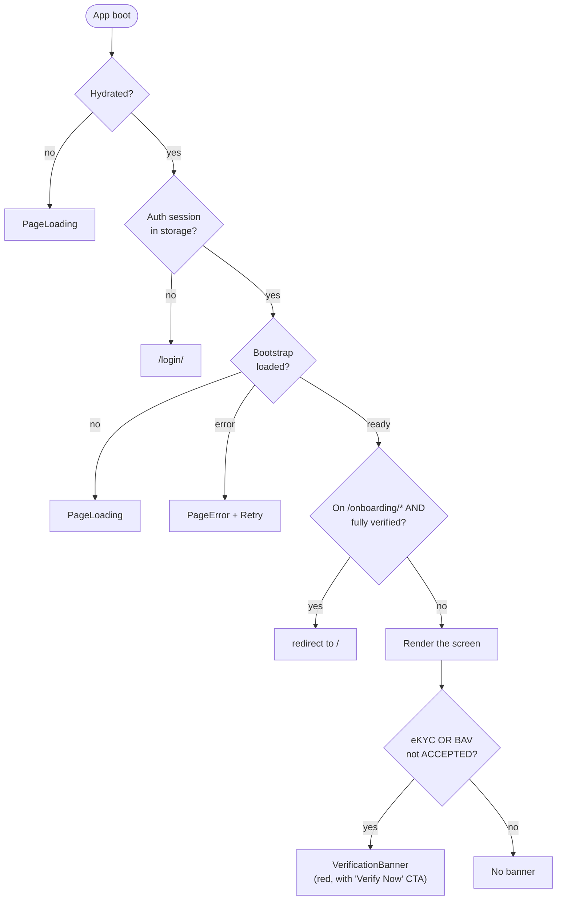
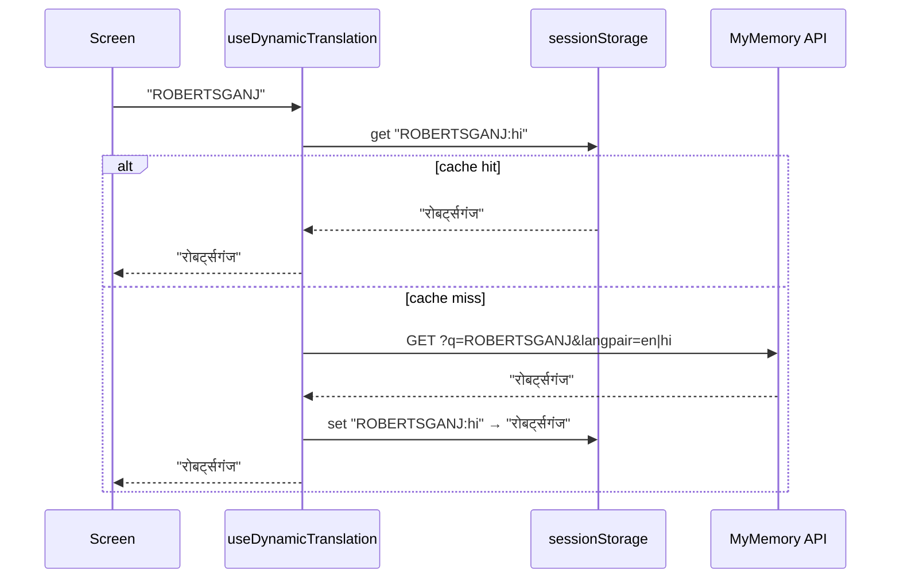
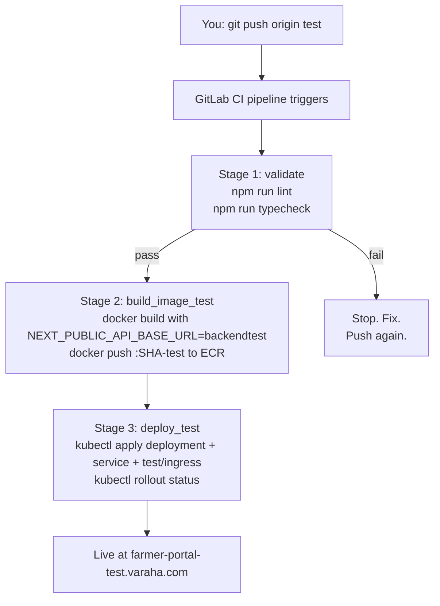
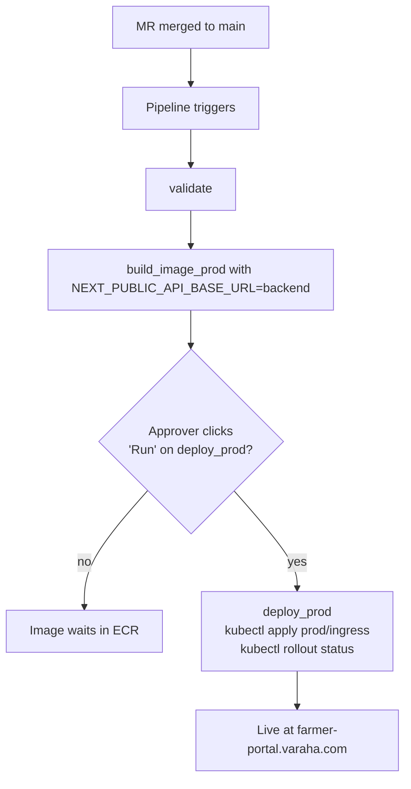
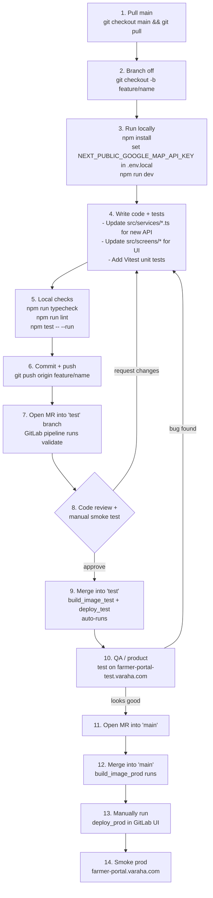

# Farmer Portal — Architecture & SDLC, Explained Like You're Five

> **Who this is for.** You are a product owner, a new engineer, or anyone
> who wants to understand *exactly* what happens when a farmer taps a button
> in the Varaha Farmer Portal — from the keystroke in their phone browser,
> through HTTPS, through our backend, and back again — and how that same
> code ships from your laptop to the test cluster to production.
>
> **You don't need to know React or Kubernetes to read this.** Each
> section starts with a plain-English paragraph and ends with the file
> paths so you can dig into the real code when you want to.

---

## Table of contents

1. [What the portal actually is](#1-what-the-portal-actually-is)
2. [The 30-second mental model](#2-the-30-second-mental-model)
3. [How a request travels — HTTPS, certificates, and trust](#3-how-a-request-travels--https-certificates-and-trust)
4. [Three environments: Local, Test, Prod](#4-three-environments-local-test-prod)
5. [The frontend, layer by layer](#5-the-frontend-layer-by-layer)
6. [The backend contract (what we expect from the server)](#6-the-backend-contract-what-we-expect-from-the-server)
7. [Authentication & sessions](#7-authentication--sessions)
8. [Bootstrap & verification gating](#8-bootstrap--verification-gating)
9. [Document gating & the two-status model](#9-document-gating--the-two-status-model)
10. [Internationalisation (i18n) + dynamic translation](#10-internationalisation-i18n--dynamic-translation)
11. [Software principles we follow (SOLID / DRY / etc.)](#11-software-principles-we-follow-solid--dry--etc)
12. [Build & deploy — going from `git push` to a live cluster](#12-build--deploy--going-from-git-push-to-a-live-cluster)
13. [The full SDLC walkthrough — Local → Test → Prod](#13-the-full-sdlc-walkthrough-local--test--prod)
14. [Security checklist (read before going live)](#14-security-checklist-read-before-going-live)
15. [How to add a new API end-to-end (cookbook)](#15-how-to-add-a-new-api-end-to-end-cookbook)
16. [Where to look when something breaks](#16-where-to-look-when-something-breaks)

---

## 1. What the portal actually is

The **Farmer Portal** is a mobile-first web app that lets a registered
Varaha farmer log in, prove who they are (Aadhaar eKYC + Bank Account
Verification), see their enrolled farms and "kyaaris" (sub-plots), and
view legally signed consent documents (Digital CRA, Digital FPIC) plus
supporting documentation (FPIC paperwork, land records, etc.).

It is **not** a native Android/iOS app. It is a single-page web app built
with **Next.js 15 (App Router)** and rendered with **React + TypeScript**.
Farmers open it in any phone browser (Chrome on Android is the dominant
case). The look and feel is engineered to feel like a native app
(card surfaces, bottom navigation, soft animations) but the runtime is
the browser.

> **Why a web app and not a native app?** One codebase, instant
> rollouts, easier QA, no app-store gatekeeping, and farmers don't have
> to download anything before getting registered.

---

## 2. The 30-second mental model



- The farmer talks to **CloudFront/ALB**, which terminates TLS and
  forwards traffic to the **Next.js pod** running in the **EKS** cluster.
- The Next.js pod renders the very first HTML, then the React app boots
  in the browser and talks to the **Django backend** at
  `https://backend(test)?.varahaag.com` for all data.
- The browser also fetches **Google Maps tiles** directly (using a
  public, referrer-restricted browser key) when the farmer opens the
  farm detail screen.

Everything below this section is just unpacking that diagram.

---

## 3. How a request travels — HTTPS, certificates, and trust

When a farmer types `https://farmer-portal.varaha.com` and hits enter,
this is what physically happens, step by step. The vocabulary in **bold**
is worth knowing because it shows up in CI logs, browser dev tools, and
production incident postmortems.

1. **DNS resolution.** The phone asks a DNS server "what IP is
   `farmer-portal.varaha.com`?". The answer is the AWS ALB's IP.
2. **TCP handshake.** Phone opens a TCP connection on port 443.
3. **TLS handshake.** Phone says "hi, I speak TLS 1.3". The server
   presents its **certificate** (a public-key blob signed by a trusted
   certificate authority — typically Amazon's own CA). The phone
   verifies the cert chain against the root CAs it trusts, and a shared
   secret is negotiated. From now on every byte is encrypted.
   - This is what the little 🔒 in the address bar means.
   - If the cert is wrong/expired/self-signed, the browser refuses the
     connection — which is why we never ship HTTP and `env.ts` will
     throw a build error if `NEXT_PUBLIC_API_BASE_URL` doesn't start
     with `https://`.
4. **HTTP request.** Inside the encrypted tunnel, the phone sends:
   ```
   GET / HTTP/1.1
   Host: farmer-portal.varaha.com
   User-Agent: Mozilla/5.0 …
   Accept: text/html
   ```
5. **The ALB forwards** the request to the **Kubernetes Service**, which
   routes it to one of the Next.js pods (round-robin).
6. **Next.js returns the HTML shell** plus a script tag pointing at the
   bundled React app. The browser parses the HTML and downloads the JS.
7. **React boots in the browser** (this is called "hydration"). From now
   on, when the farmer navigates inside the app, it's **React Router
   client-side navigation** — no full page reload.
8. **API calls** (e.g. `POST /api/mobile/v2/login-otp/`) follow the same
   TLS dance, but they go directly from the browser to
   `https://backend.varahaag.com` (in prod) or are **proxied** through
   the Next.js dev server (in local dev — see §4).
9. The response is a JSON blob, the React state updates, and the UI
   re-renders. The whole loop is usually < 300 ms.

### Why HTTPS matters here (not just "for the lock icon")

- **Confidentiality.** OTPs, bearer tokens, and masked Aadhaar numbers
  would otherwise be readable by anyone on the same Wi-Fi.
- **Integrity.** A man-in-the-middle can't tamper with the OTP-validate
  response to make "REJECTED" look like "ACCEPTED".
- **Authenticity.** The cert proves the farmer is talking to *our*
  backend and not a phishing imitation.

---

## 4. Three environments: Local, Test, Prod

We run the **same code** in three places, configured differently. This
is the single most important thing to internalise about modern web
development.

| | Local (your laptop) | Test (`backendtest.varahaag.com`) | Prod (`backend.varahaag.com`) |
| --- | --- | --- | --- |
| **Frontend host** | `http://localhost:3000` | `farmer-portal-test.varaha.com` | `farmer-portal.varaha.com` |
| **Backend** | proxied via Next rewrites → `DEV_PROXY_TARGET` | `https://backendtest.varahaag.com` | `https://backend.varahaag.com` |
| **TLS** | none (HTTP loopback is fine) | yes (AWS-issued) | yes (AWS-issued) |
| **Built from branch** | `git checkout` | `test` branch | `main` branch (manual approval) |
| **Where it runs** | `npm run dev` | EKS cluster `Varaha-Test` | EKS cluster `Varaha-Prod` |
| **Data** | hits the test database (via proxy) | test database | **real farmer data** |
| **Build artefact** | none — Vite-style HMR | Docker image tagged `…-test` in ECR | Docker image (no `-test` suffix) in ECR |
| **Promote how** | n/a | push to `test` branch | merge into `main`, then manually run `deploy_prod` |

### What the dev proxy is, in one paragraph

When you run `npm run dev`, the Next dev server listens on
`http://localhost:3000`. It also installs **rewrites** (see
`next.config.ts`) that say "anything to `/api/*` or `/core/*`, forward
to `DEV_PROXY_TARGET`". So when the React app calls
`fetch('/api/mobile/v2/login-otp/')`, the dev server transparently
proxies it to `https://backendtest.varahaag.com/api/mobile/v2/login-otp/`.
This sidesteps CORS during local development and gives you a real
backend without spinning up your own.

```
Browser ─▶ http://localhost:3000/api/...   (same-origin, no CORS)
              │
              ▼
        Next dev server (next.config.ts rewrites)
              │
              ▼
        https://backendtest.varahaag.com/api/...
```

### `NEXT_PUBLIC_*` versus everything else

Next.js bakes any env var named `NEXT_PUBLIC_*` into the **client
bundle** at build time. That means:

- `NEXT_PUBLIC_API_BASE_URL` → safe to be public (it's a URL)
- `NEXT_PUBLIC_GOOGLE_MAP_API_KEY` → safe **only if** you restrict it by
  HTTP referrer in the Google Cloud Console; otherwise anyone can lift
  it from `view-source` and bill your account
- **Never** put database passwords, Django secret keys, or refresh
  tokens in a `NEXT_PUBLIC_*` variable.

Anything secret lives **server-side only** (Django settings in Vault /
SSM / a Kubernetes `Secret`), and the frontend gets a short-lived bearer
token in exchange for a valid OTP. That's the only secret the browser
ever holds, and it's in `sessionStorage` (tab-scoped, gone when the tab
closes) — not `localStorage`.

---

## 5. The frontend, layer by layer

The frontend has a clear separation of concerns. Each layer has one
job. If you find yourself making a network call in a button onClick
handler, you're crossing layers and we will refactor it in review.



### Layer-by-layer responsibility

| Layer | Folder | What it does | What it MUST NOT do |
| --- | --- | --- | --- |
| **Screens & components** | `src/screens/`, `src/components/` | Render markup, handle UI state (form values, dialogs open/closed), call hooks. | Call `fetch` directly. Hard-code URLs. Touch `sessionStorage`. |
| **Hooks / contexts** | `src/hooks/`, `src/bootstrap/`, `src/auth/` | Wrap React Query queries/mutations, expose `{data, error, loading, refresh}`. Hold cross-screen state (auth, bootstrap, query cache). | Render JSX (that's the screen's job). |
| **Service layer** | `src/services/*Api.ts` | One named function per backend endpoint (`requestLoginOtp`, `postEkycInitiate` …). Pure async functions, no React. | Know anything about React. Know anything about URLs (they go through `getApiUrl(key)`). |
| **HTTP helpers** | `src/services/http/{postJson,postJsonAuth,getJsonAuth,ApiError}.ts` | Wrap `fetch`, attach auth headers, parse JSON safely, throw a typed `ApiError`, force-logout on 401. | Be aware of any specific endpoint. |
| **Config / registry** | `src/config/{env,apiRegistry,apiUrl}.ts` | Read env vars, validate them, expose a typed `getApiUrl('loginOtp')` lookup. `ensureApiTrailingSlash` enforces Django's `APPEND_SLASH`. | Read anything from the DOM. |

### Why this layering exists

- **Testability.** The service-layer functions are plain async
  functions; you can stub `fetch` in Vitest without mounting React.
- **Refactor safety.** When the backend renames an endpoint, exactly
  one file changes: `apiRegistry.ts`. No `find-and-replace` across 40
  components.
- **Security.** Auth headers are added in exactly one place
  (`postJsonAuth`). A new contributor cannot accidentally fire an
  authenticated request without going through the wrapper that also
  knows what to do on 401.

### The most important files to know

| File | One-line purpose |
| --- | --- |
| `src/app/(portal)/layout.tsx` | App-router root layout: wraps everything in `AuthProvider`, `QueryProvider`, `BootstrapProvider`, `I18nProvider`. |
| `src/routing/RequireAuth.tsx` | Gate: if no session, redirect to `/login/`. |
| `src/routing/RequireBootstrap.tsx` | Gate: wait for `composeBootstrap()` to settle; on error show `PageError`; on success render children. |
| `src/bootstrap/BootstrapProvider.tsx` | React-Query-backed cache of the bootstrap blob; exposes `{ bootstrap, refresh }`. |
| `src/services/bootstrapService.ts` | Calls `GET /farmer/bootstrap/` (or falls back to profile + farms count + mapping). |
| `src/hooks/useLoginFlow.ts` | Phone → OTP → validate state machine for the login screen. |
| `src/types/verification.types.ts` | `getOnboardingNextPath` — single source of truth for where to send a partially-verified user. |
| `src/utils/derivedNotifications.ts` | Synthesises the Alerts feed from bootstrap statuses (used until backend notifications ship). |

---

## 6. The backend contract (what we expect from the server)

The frontend speaks to two URL prefixes:

- **`/api/mobile/v2/*`** — the authenticated Farmer Portal API (Django).
- **`/core/api/*`** — public geo lookups (country/state/district/block).

Every endpoint, request body, response body, and error code lives in
[`docs/API_INTEGRATION.md`](./API_INTEGRATION.md). That file is the
**single source of truth**; do not rely on what an old screen used to
do.

The portal's expectations from the backend, in three rules:

1. **One bootstrap call answers "who is this farmer and what's their
   state?"** — see `GET /api/mobile/v2/farmer/bootstrap/` in
   API_INTEGRATION §2. This avoids N status calls on every page load.
2. **All status enums are uppercase and from a fixed set:**
   `MISSING | PENDING | IN_PROGRESS | ACCEPTED | REJECTED`. No
   `"approved"`, no `"verified"`, no `null` masquerading as "pending".
3. **Trailing slashes on every API path.** Django's `APPEND_SLASH` will
   302-redirect non-slashed URLs, and the redirect drops the auth header
   on some browsers. The FE's `ensureApiTrailingSlash` enforces it from
   our side; please don't disable `APPEND_SLASH` server-side.

### The two-status doc model (recap)

Because farmers and reviewers care about different things in different
sections, **documents** have two completely different status
vocabularies depending on where they live (full detail in
API_INTEGRATION §5 and §9):

- **Digital Consents** (Digital CRA, Digital FPIC) — system-generated.
  Two states only: **Generated** (a `media_url` exists) or **Yet to
  generate** (no row, or row exists without a usable URL).
- **Documentation** (FPIC, FPIC Local, Holding Consent, Land Record,
  Landlord Declaration) — farmer-supplied. Four states: **Pending /
  Accepted / Rejected / Missing.** The fourth state is implicit:
  *absence of a row* means "Missing".

---

## 7. Authentication & sessions

The login flow is deliberately simple. There are no passwords. The only
secret in the browser is a **bearer token** received in exchange for a
valid OTP. The token lives in `sessionStorage` (so it dies when the tab
closes) under the key `fp_auth_session_v1`.



The session record persisted in `sessionStorage` looks like:

```json
{
  "version": 1,
  "accessToken": "eyJhbGc...",
  "tokenType": "Bearer",
  "clientHeader": { "name": "X-Client-ID", "value": "8f44b0a2-..." }
}
```

From this point onwards, every authenticated request goes through
`postJsonAuth` / `getJsonAuth`, which:

1. Reads the session from `sessionStorage`.
2. Adds `Authorization: Bearer <accessToken>` plus the dynamic
   `X-Client-ID` (or whatever name the backend handed back).
3. Calls `fetch`.
4. If the response is `401`, clears the session and `window.location
   .replace('/login/')` so React state and storage stay in sync.

> **Why a "dynamic" client header?** The backend returns the header
> *name* and *value* on login, which lets us swap the name (or rotate
> the value scheme) without a frontend release. It's a small lever for
> ops.

### Logout

`AuthProvider.logout` calls `POST /api/mobile/v2/logout/` with
`keepalive: true` (so it survives a tab close), then clears
`sessionStorage` and navigates to `/login/`. Failure of the backend
call is *swallowed* on purpose — your local session is gone either way.

---

## 8. Bootstrap & verification gating

Right after login, the app does **one** call: `GET /farmer/bootstrap/`.
This returns a blob that tells every screen everything it needs to know
about who's logged in:

- `farmerId`, `farmerProfile.{name, mobileNumber, profilePhotoUrl, region}`
- `identityConfirmed` (boolean)
- `ekycStatus`, `bavStatus` (the verification enums)
- `maskedAadhaar`, `maskedBankAccountNumber`
- `farmsSummary.count` (for the "MY REGISTRY · N UNITS" badge)

The bootstrap blob is the **only** thing `RequireBootstrap` waits for.
Until it arrives we show `PageLoading`; on error we show `PageError`
with Retry + Logout buttons.

Once we have it, the routing rules are deliberately liberal — the
farmer is **never blocked from landing on `/`** just because their
Aadhaar isn't verified. Instead, we show a red banner with a "Verify
Now" CTA. This is the post-summary architecture change requested by
product: the portal should not feel like a verification jail.



### Where does "Verify Now" go?

The CTA path comes from `getOnboardingNextPath(identityConfirmed,
ekyc, bav)` in `src/types/verification.types.ts`. The rule, in plain
English:

1. If eKYC is not `ACCEPTED` → `/onboarding/claim/` (the "Is this you?"
   screen) — Claim is the first step of *every* eKYC journey, per spec.
2. Else if BAV needs work → `/onboarding/bav-intro/`.
3. Else → home (`/`).

After the Claim screen, `getPostClaimNextPath(ekyc, bav)` decides what
to render next (eKYC intro / BAV intro / home). Keeping these two
helpers separate is what stops the Claim screen from redirecting back
to itself in an infinite loop.

---

## 9. Document gating & the two-status model

Documents are served from S3 via signed `media_url`s. There are **two
layers of gating**:

```mermaid
flowchart TD
    subgraph Listing["Listing layer — Farm Detail screen"]
      L1["Digital Consent row"] -->|always rendered| L2["Generated / Yet to generate"]
      L3["Documentation row"] -->|always rendered| L4["Pending / Accepted / Rejected / Missing"]
    end

    subgraph Viewer["Viewer layer — /document/&#123;id&#125;/"]
      V1["Open Digital Consent"] --> V2{"ekycStatus<br/>== ACCEPTED?"}
      V2 -- no --> V3["Lock screen<br/>'Verify now to view'"]
      V2 -- yes --> V4["Render PDF<br/>+ AI voice summary"]
      V5["Open Documentation"] --> V6["Render PDF<br/>no AI summary"]
    end

    L1 -.-> V1
    L3 -.-> V5
```



The listing is **never** gated — the farmer always sees that a digital
consent *exists*. The PDF body is only revealed in the viewer when eKYC
is accepted. This split exists because the legal team wanted farmers to
know their CRA was ready, even before they finished eKYC, so the
"motivation to verify" is visible.

The viewer-layer rule is enforced **client-side** in
`src/utils/documentGating.ts` *and* must be re-enforced **server-side**
(the backend should `403` a `GET /media/{id}/` for Digital CRA/FPIC if
the farmer's `ekyc_status != "ACCEPTED"`). The client check is a UX
improvement; the server check is the security boundary.

---

## 10. Internationalisation (i18n) + dynamic translation

The portal supports four languages: **English, Hindi, Kannada, Tamil**.
There are two kinds of strings:

1. **Static strings** (button labels, headings, helper text). These are
   in `src/i18n/locales/{en,hi,kn,ta}.json` and consumed via the
   `useTranslation()` hook from `react-i18next`. Adding a new key means
   adding it to all four files; CI will fail if you forget.

2. **Dynamic strings from the backend** (region names like
   "ROBERTSGANJ · SONBHADRA · UTTAR_PRADESH", surveyor names,
   organisation names). These can't be in JSON files because the values
   come from the database at runtime. We translate them via the public
   **MyMemory Translation API**, cached in `sessionStorage` so we don't
   re-translate the same phrase on every render. The wiring lives in
   `src/services/translateService.ts` + `src/i18n/useDynamicTranslation.tsx`.



Switching the language at runtime is a single call:
`i18n.changeLanguage('hi')` + writing the choice to
`localStorage` (`fp_preferred_language`). The next bootstrap call
returns the same preference back, so the user keeps their language
across devices (once the `PATCH /farmer/preferences/` endpoint ships).

---

## 11. Software principles we follow (SOLID / DRY / etc.)

This is not academic — these are the principles we point to in pull
request reviews. If a change violates one of these, the reviewer will
ask for a refactor.

| Principle | What it means here | Where to see it |
| --- | --- | --- |
| **Single Responsibility** | One function = one backend endpoint. One screen file = one screen. | `src/services/onboardingApi.ts` — every exported function maps 1:1 to a `POST /…/`. |
| **DRY** ("Don't Repeat Yourself") | The bootstrap composes one canonical farmer state. Status enums are defined exactly once in `verification.types.ts`. | `src/types/verification.types.ts`, `src/utils/bootstrapMapping.ts`. |
| **Separation of concerns** | Networking lives in `services/`, React state lives in hooks/contexts, presentation lives in components. | The 5-layer diagram in §5. |
| **Atomicity** | Each backend write either fully succeeds or returns non-2xx — we never end up half-onboarded. The FE retries idempotent calls but never makes compound writes from the client. | API_INTEGRATION §6 (onboarding writes). |
| **Idempotency** | `POST identity-confirmation`, `POST bav/validate`, and `POST logout` can be retried without side effects. The FE tolerates `404`/`501` on these as "endpoint not deployed yet" during integration. | `src/services/onboardingApi.ts`. |
| **Least privilege** | Every authenticated path is scoped to the calling farmer via the Bearer token. The FE never sends `farmer_id` in a body — that would let a compromised client target another farmer. | All bodies in `src/types/*.api.ts`. |
| **Fail loud, recover gracefully** | `ApiError` carries `status + body + message`. Screens catch it and show a `Toast` or `PageError` with a Retry button. | `src/services/http/ApiError.ts`. |
| **Open/Closed** | Adding a new endpoint is "open" (you add a key to `apiRegistry` + a function in `services/`) but the HTTP wrappers are "closed" (they don't change). | `src/services/http/postJsonAuth.ts`. |
| **Mobile-first, progressive enhancement** | CSS uses fluid spacing tokens and `@media` only to widen breakpoints, never to remove features on small screens. | `src/styles/base/tokens.css`. |
| **No secrets in the bundle** | `NEXT_PUBLIC_*` vars are reviewed for sensitivity; refresh tokens and DB creds stay in K8s `Secret`s. | `src/config/env.ts` enforces HTTPS in prod and whitelists allowed bases. |

---

## 12. Build & deploy — going from `git push` to a live cluster

We use **GitLab CI** (`.gitlab-ci.yml`) with three stages: **validate →
build → deploy**. The branch you push to determines whether it builds
for test or prod.



For prod, the flow is identical *except* the deploy step is **manual**:



### What's actually in the Docker image

The Dockerfile is a 3-stage build:

1. **deps**: `npm ci` (so subsequent builds re-use the layer when
   `package-lock.json` is unchanged).
2. **builder**: copies the source, sets the build-time env vars
   (`NEXT_PUBLIC_*`), runs `npm run build`. Next emits a **standalone**
   server (a self-contained `node` process).
3. **runner**: a tiny `node:22-alpine` image that just runs
   `node server.js`. It listens on port 80 inside the container, runs as
   a non-root user, and exposes a `GET /healthz` so K8s can probe it.

ECR images are tagged `…:SHA-test` for the test branch and `…:SHA` for
prod. The K8s `Deployment` YAML has a placeholder `DOCKER_IMAGE` that
the CI's `sed` rewrites to the real tag before `kubectl apply`.

---

## 13. The full SDLC walkthrough — Local → Test → Prod

This is what your day-to-day looks like as an engineer on this codebase.



### Why the branches are named the way they are

- `development` — runs validate-only on every push. Treat as a holding
  area for in-flight work; nothing auto-deploys.
- `test` — *every push* builds + deploys to the test cluster. So merge
  here when you're confident enough for QA to look at it.
- `main` — *every push* builds a prod image, but only a human can click
  Deploy. So merge here when QA has signed off.

### Important: the "test" cluster talks to the test backend

`backendtest.varahaag.com` has its own database, distinct from
production. **Do not assume data parity** between test and prod. When a
backend engineer flips a flag in test, prod is unaffected. When QA
creates a fake farmer in test, that farmer does not exist in prod.

---

## 14. Security checklist (read before going live)

This is the short version of the longer list in
`docs/API_INTEGRATION.md` §13 and §14. If you're a project manager, walk
through this with the engineer the day before going prod.

- [ ] **HTTPS everywhere.** `src/config/env.ts` will throw at build
      time if `NEXT_PUBLIC_API_BASE_URL` is not `https://`.
- [ ] **CORS** allows the portal origin and the dynamic `X-Client-ID`
      header (the `name` returned by `/login-validate/`).
- [ ] **CSP** (Content Security Policy) is set on the ingress to:
      ```
      default-src 'self';
      img-src 'self' https://artifacts-varaha-test.s3.amazonaws.com data:;
      script-src 'self';
      connect-src 'self' https://backend.varahaag.com https://maps.googleapis.com;
      ```
      This is the bare minimum to mitigate token theft via XSS.
- [ ] **Bearer tokens** live in `sessionStorage` (tab-scoped). Logout
      clears them locally; the backend should also invalidate the
      refresh token server-side.
- [ ] **Google Maps key** restricted by HTTP referrer to
      `farmer-portal(test)?.varaha.com` in Google Cloud Console.
- [ ] **Rate limit** on `/login-otp/` (≥3/min, ≥10/hour) to prevent
      OTP-bombing a registered mobile.
- [ ] **Server-side gating** for digital consent PDFs — the FE locks
      the viewer, but the backend MUST `403` the `media_url` for a
      farmer whose `ekyc_status != "ACCEPTED"`.
- [ ] **Logging hygiene** — never log request bodies, headers, OTPs,
      tokens, Aadhaar numbers, or account numbers anywhere in the FE
      bundle. The `ApiError` constructor takes care of `message`-only
      surfacing.

---

## 15. How to add a new API end-to-end (cookbook)

Use this as a checklist whenever the backend ships a new endpoint.
Assume the new endpoint is `POST /api/mobile/v2/farmer/foo/`.

1. **Register the URL.** Add it to `src/config/apiRegistry.ts`:
   ```ts
   foo: '/api/mobile/v2/farmer/foo/',
   ```
2. **Type the request/response.** Add a file like `src/types/foo.api.ts`:
   ```ts
   export type FooRequestBody = { bar: string }
   export type FooResponseBody = { bazId: string }
   ```
3. **Add the service function.** In a new or existing `*Api.ts` under
   `src/services/`:
   ```ts
   export async function postFoo(body: FooRequestBody): Promise<FooResponseBody> {
     return postJsonAuth<FooResponseBody>(getApiUrl('foo'), body)
   }
   ```
4. **Consume from a hook or component.** Prefer wrapping in a React
   Query mutation if it's a write or a useQuery if it's a read:
   ```ts
   const { mutateAsync, isPending } = useMutation({ mutationFn: postFoo })
   ```
5. **Surface errors via `ApiError`.** Use a `Toast` for transient
   failures, `PageError` for screen-level failures.
6. **Update the docs.** Add the endpoint to
   `docs/API_INTEGRATION.md` §11 (consumer index) and write the
   request/response/error table.
7. **Add a unit test.** Stub the URL with `vi.mock(global.fetch)` and
   assert the service function returns the parsed body.
8. **Push, MR, review, ship.**

---

## 16. Where to look when something breaks

| Symptom | First place to look | Second place |
| --- | --- | --- |
| Farmer can't log in | Browser dev tools → Network → `POST /login-otp/` response | `kubectl logs deploy/farmer-portal -n platform` for any 5xx |
| Bootstrap fails after login | Network → `GET /farmer/bootstrap/` response body | `src/utils/bootstrapMapping.ts` for snake/camel mismatch |
| White screen post-login | React DevTools → BootstrapProvider state | `RequireBootstrap` returning `loading` forever = a hanging fetch |
| Document viewer shows "Locked" but should not | `bootstrap.ekycStatus` value | `src/utils/documentGating.ts` rules |
| Map shows fallback panel | `NEXT_PUBLIC_GOOGLE_MAP_API_KEY` set? Restart `npm run dev` after editing `.env.local` | Google Cloud Console → key restrictions |
| Build fails in CI on `npm run lint` | Local: `npm run lint` (same eslint config) | `eslint.config.js` for ignored paths |
| Build fails in CI on `npm run typecheck` | Local: `npm run typecheck` | `tsconfig.json` for path aliases |
| Pod failing readiness | `kubectl describe pod -n platform` → events | `Dockerfile` HEALTHCHECK; the app must respond `200` on `GET /healthz` |
| Wrong language used post-login | `bootstrap.preferredLanguage` value | `localStorage.fp_preferred_language` |

---

## Appendix A — Glossary for non-engineers

| Term | Plain-English meaning |
| --- | --- |
| **API** | A URL you can call to get/send data (e.g. `POST /login-otp/`). |
| **Bearer token** | A short string that proves "I'm a logged-in user". Travels in the `Authorization` header. |
| **CI/CD** | Continuous Integration / Continuous Delivery. Software that watches our git repo and automatically tests/builds/ships code. We use GitLab CI. |
| **CORS** | Cross-Origin Resource Sharing. A browser rule that blocks JS on site A from calling site B unless site B explicitly allows it. |
| **Docker image** | A frozen snapshot of an app + its OS, so it runs identically on any machine. |
| **ECR** | Elastic Container Registry. AWS's hosted Docker registry — where our images are pushed by CI. |
| **EKS** | Elastic Kubernetes Service. AWS's managed Kubernetes — where our pods actually run. |
| **HTTPS** | HTTP wrapped in a TLS encryption tunnel. |
| **Hydration** | The moment when React "takes over" the server-rendered HTML in the browser and makes it interactive. |
| **Kubernetes / K8s** | The system that schedules our pods, restarts them when they crash, and routes traffic to healthy ones. |
| **Pod** | A running instance of our app inside Kubernetes. We usually have 2–3 in test, 3+ in prod. |
| **React Query** | The library that owns the cache of "data fetched from the backend" on the frontend. It dedupes, refetches on focus, and exposes loading/error state. |
| **sessionStorage / localStorage** | Tiny key-value stores in the browser. Session = dies on tab close, local = persists across sessions. |
| **SDLC** | Software Development Life Cycle. The flow from idea → code → review → test → ship → monitor. |
| **TLS** | Transport Layer Security. The encryption layer underneath HTTPS. |

---

## Appendix B — One-page cheat sheet

```
ENVIRONMENTS
  local  → http://localhost:3000  (npm run dev, dev-proxy → backendtest)
  test   → farmer-portal-test.varaha.com  (auto-deployed from 'test' branch)
  prod   → farmer-portal.varaha.com       (manual-deployed from 'main' branch)

BACKEND BASE URLS
  test   → https://backendtest.varahaag.com
  prod   → https://backend.varahaag.com

LAYERING (top → down)
  Screens (src/screens/*)
    └── Hooks (src/hooks/*, providers)
          └── Services (src/services/*Api.ts)
                └── HTTP helpers (src/services/http/*)
                      └── Config (src/config/{env,apiUrl,apiRegistry}.ts)

DAILY COMMANDS
  npm install
  npm run dev          # localhost:3000 with HMR
  npm run typecheck    # tsc --noEmit
  npm run lint         # eslint .
  npm test -- --run    # vitest
  npm run build        # production Next.js build

SHIP IT
  feature branch → MR into 'test' → auto-deploy to test cluster
  MR test → 'main' → image built, manual Deploy in GitLab UI

DEBUGGING ORDER
  1. Browser Network tab — what request was made? what came back?
  2. Browser Console    — any uncaught errors?
  3. React DevTools     — what does BootstrapProvider state look like?
  4. kubectl logs       — what does the pod say?
  5. GitLab pipeline    — did the latest commit even ship?
```
